# pratikum7
### Nama : Ananda Prasca Appandi
### Nim  : 312010157   
### Kelas : TI.20.A1

# laporan pratikum
Dipertemuan kali ini akan saya akan mempelajari tentang PHP dasar pada html

1.  Pertama kita menjalankan web server dari menu XAMPP Control.
<p align="center">
	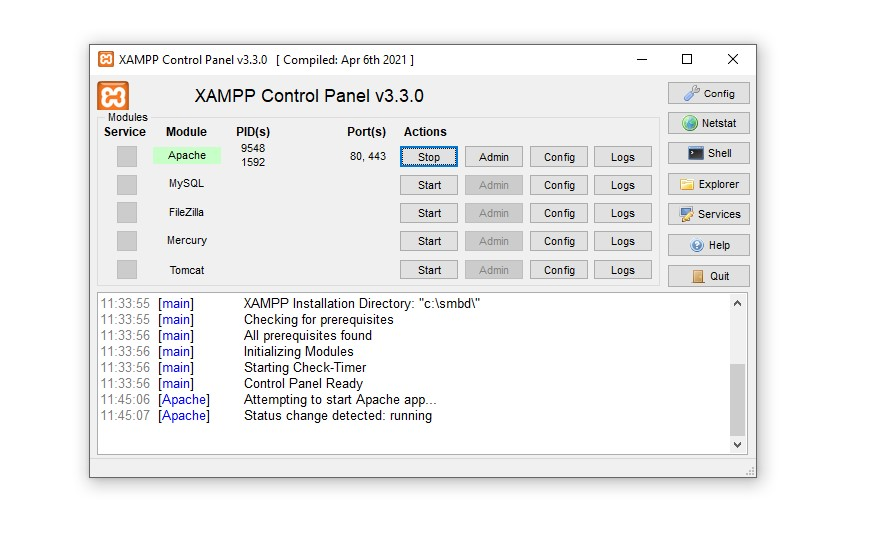
</p>

2. membuat folder lab7_php_dasar dan mengecek di http://localhost/lab7_php_dasar/
<p align="center">
	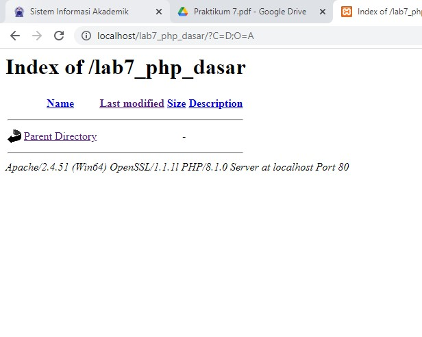
</p>

3. lalu buat directory pada php_dasar dengan kode berikut.
```
<!DOCTYPE html>
<html lang="en">
<head>
<meta charset="UTF-8">
<title>PHP Dasar</title>
</head>
<body>
<h1>Belajar PHP Dasar</h1>
<?php
echo "Hello World";
?>
</body>
</html>
```
dan hasilnya
<p align="center">
	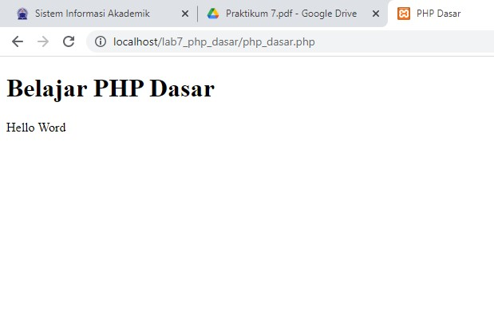
</p>

4.  menambahkan variable PHP dengan kode
```
<?php
$nim = "0411500400";
$nama = 'Abdullah';
echo "NIM : " . $nim . "<br>";
echo "Nama : $nama";
?>
```
Dan ini hasilnya
<p align="center">
	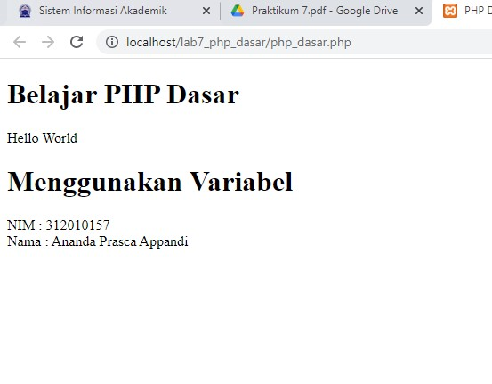
</p>

5.  membuat file latihan2.php dan membuat kode sebagai berikut
```
<!DOCTYPE html>
<html lang="en">
<head>
<meta charset="UTF-8">
<title>PHP Dasar</title>
</head>
<body>
<h1>Predifine Variable</h1>
<?php
echo "Selamat datang";
?>
</body>
</html>
```
Dan ini hasilnya
<p align="center">
	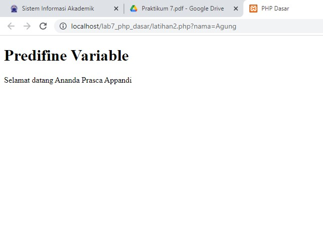
</p>

6.  membuat form input dengan kode
```
<!DOCTYPE html>
<html lang="en">
<head>
<meta charset="UTF-8">
<title>PHP Dasar</title>
</head>
<body>
<h2>Form Input</h2>
<form method="post">
<label>Nama: </label>
<input type="text" name="nama">
<input type="submit" value="Kirim">
</form>
<?php
echo 'Selamat Datang ' . $_POST['nama'];
?>
</body>
</html>
```
Dan ini hasil nya
<p align="center">
	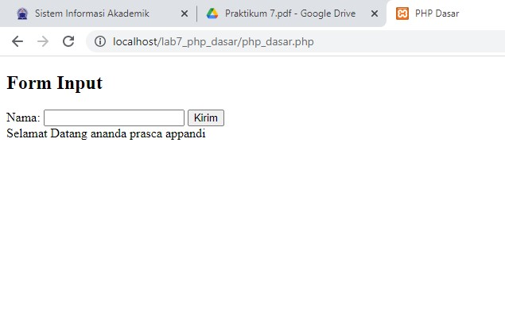
</p>

7.  membuat data operator dengan kode
```
<!DOCTYPE html>
<html lang="en">
<head>
<meta charset="UTF-8">
<title>PHP Dasar</title>
</head>
<body>
<h2>Operator</h2>
<?php
$gaji = 1000000;
$pajak = 0.1;
$thp = $gaji - ($gaji*$pajak);
echo "Gaji sebelum pajak = Rp. $gaji <br>";
echo "Gaji yang dibawa pulang = Rp. $thp";
?>
```
dengan hasil
<p align="center">
	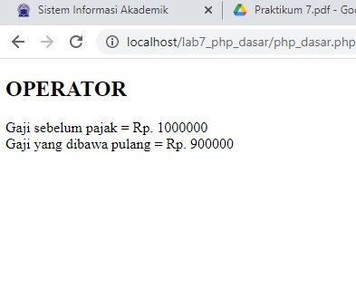
</p>

8.  membuat kondisi IF dengan kode
```
<!DOCTYPE html>
<html lang="en">
<head>
<meta charset="UTF-8">
<title>PHP Dasar</title>
</head>
<body>
<h2>Kondisi If</h2>
<?php
$nama_hari = date("l");
if ($nama_hari == "Sunday") {
echo "Minggu";
} elseif ($nama_hari == "Monday") {
echo "Senin";
} else {
echo "Selasa";
}
?>
```
dengan hasil
<p align="center">
	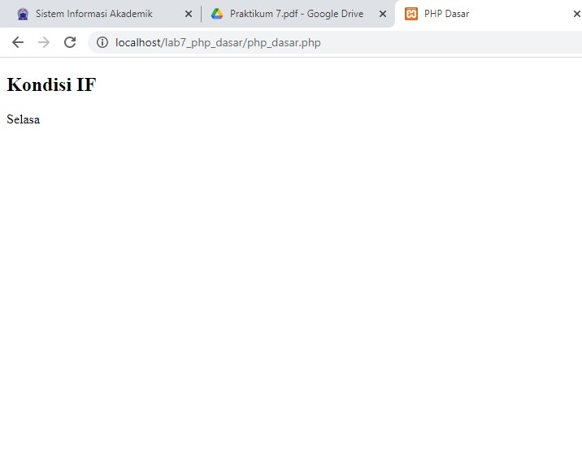
</p>

9.  Membuat data kondisi switch dengan kode
```
<!DOCTYPE html>
<html lang="en">
<head>
<meta charset="UTF-8">
<title>PHP Dasar</title>
</head>
<body>
<h2>Kondisi Switch</h2>
<?php
$nama_hari = date("l");
switch ($nama_hari) {
case "Sunday":
echo "Minggu";
break;
case "Monday":
echo "Senin";
break;
}
?>
```
dengan hasil
<p align="center">
	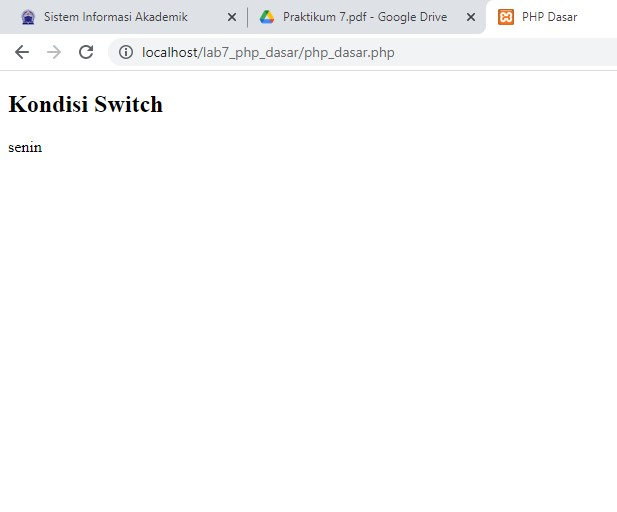
</p>

10. membuat perulangan for dengan kode
```
<!DOCTYPE html>
<html lang="en">
<head>
<meta charset="UTF-8">
<title>PHP Dasar</title>
</head>
<body>
<h2>Perulangan For</h2>
<?php
echo "Perulangan 1 sampai 10 <br />";
for ($i=1; $i<=10; $i++) {
echo "Perulangan ke: " . $i . '<br />';
}
echo "Perulangan Menurun dari 10 ke 1 <br />";
for ($i=10; $i>=1; $i--) {
echo "Perulangan ke: " . $i . '<br />';
}
?>
```
dengan hasil
<p align="center">
	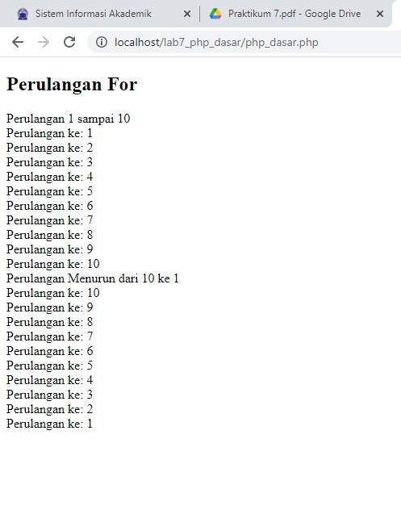
</p>

11. membuat perulangan while dengan kode
```
<!DOCTYPE html>
<html lang="en">
<head>
<meta charset="UTF-8">
<title>PHP Dasar</title>
</head>
<body>
<h2>Perulangan while</h2>
<?php
echo "Perulangan 1 sampai 10 <br />";
$i=1;
while ($i<=10) {
echo "Perulangan ke: " . $i . '<br />';
$i++;
}
?>
```
dengan hasil
<p align="center">
	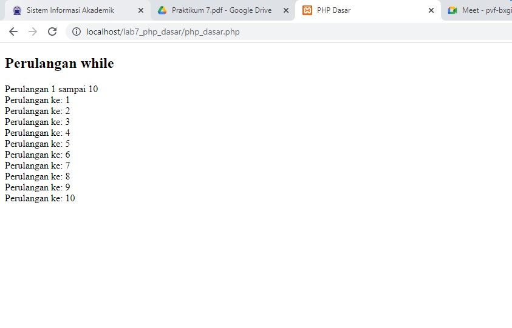
</p>

12. membuat perulangan dowhile dengan kode
```
<!DOCTYPE html>
<html lang="en">
<head>
<meta charset="UTF-8">
<title>PHP Dasar</title>
</head>
<body>
<h2>Perulangan dowhile</h2>
<?php
echo "Perulangan 1 sampai 10 <br />";
$i=1;
do {
echo "Perulangan ke: " . $i . '<br />';
$i++;
} while ($i<=10);
?>
```
dengan hasil
<p align="center">
	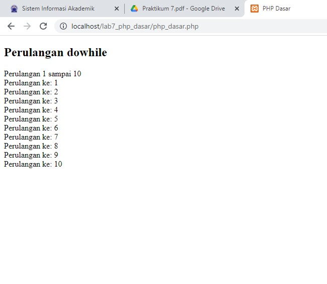
</p>


